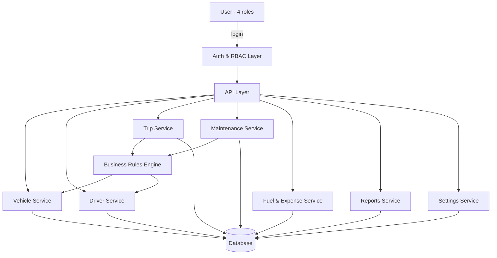

# TransitOps — Architecture Blueprint (architecture.md)

Built from `specs.md`. This is a **flexible blueprint** — decisions below are reasonable defaults made to unblock design, not final commitments. Every decision made without a confirmed source is marked **[DECISION – verify]** and maps to an open question in `specs.md` §17. No specific technology/framework is chosen (none is documented anywhere); this describes structure and responsibility, not implementation.

---

## 1. High-Level Architecture

Layered, modular architecture with strict separation between UI, API, business rules, and data:

```
Client (Web SPA, role-aware UI)
        │  HTTPS
        ▼
API Layer (REST, grouped by module, RBAC-enforced)
        │
        ▼
Business Logic / Rules Engine (status transitions, validations)
        │
        ▼
Data Layer (relational DB)
```

**[DECISION – verify]** RBAC and business-rule enforcement live server-side (API + rules engine), never trusted from the client. This is standard practice, not stated in source docs, but necessary given specs.md's RBAC and business-rule requirements (§6, §9).

## 2. System Diagram (Mermaid)



## 3. Components (per specs.md §7)

| Component | Responsibility |
|---|---|
| Auth & RBAC | Login, session/token issuance, lockout, role resolution |
| Vehicle Service | Vehicle CRUD, status lifecycle |
| Driver Service | Driver CRUD, status lifecycle, license validity checks |
| Trip Service | Trip CRUD, lifecycle transitions, dispatch validation |
| Maintenance Service | Maintenance record CRUD, vehicle status side-effects |
| Fuel & Expense Service | Fuel logs, expense logs, cost aggregation |
| Reports Service | KPI/metric computation, CSV (and optional PDF) export |
| Settings Service | Depot config, RBAC matrix config |
| Business Rules Engine | Centralized enforcement of all 10 mandatory rules (specs.md §9) |

Rules Engine is called out as its own component (not folded into each service) so that all 10 business rules stay in one place instead of duplicated per module — this directly reduces the risk of the inconsistent enforcement flagged as a concern in specs.md §11.

## 4. Frontend Architecture

- Single-page application, one shell with role-aware navigation (only modules the logged-in role can access are shown — per specs.md §6 login-screen mapping).
- One screen per module (9 screens, matching specs.md §7): Dashboard, Vehicle Registry, Drivers, Trip Dispatcher, Maintenance, Fuel & Expenses, Reports, Settings, Auth.
- Shared components: status badges (Available/On Trip/In Shop/Retired, etc.), data tables with filters, form validation for capacity/uniqueness/license checks — mirrored client-side for UX, but never the source of truth (server re-validates).
- **[DECISION – verify]** Desktop + tablet responsive only, per specs.md §11 draft NFR; not confirmed for mobile.

## 5. Backend Architecture

- Module-per-domain services (table above), each owning its own CRUD.
- Rules Engine sits between Trip/Maintenance services and Vehicle/Driver services — it's the only path allowed to change vehicle/driver `status`, so status can't drift out of sync with business rules regardless of which screen triggered the change.
- **[DECISION – verify]** Trip completion (odometer + fuel entry) is a manual form step performed by the Dispatcher, since specs.md §16 item 7 flags this as undocumented and the screenshot only shows the sequence, not who enters what.

## 6. Database Layer

Relational database (entities match specs.md's Expected DB Entities: Users, Roles, Vehicles, Drivers, Trips, Maintenance Logs, Fuel Logs, Expenses). Full field-level design belongs in `database.md`, not here. Key structural decisions:

- Vehicle/Driver `status` fields are enums, mutated only by the Rules Engine.
- Trip has a `status` enum (Draft/Dispatched/Completed/Cancelled) plus foreign keys to Vehicle and Driver.
- Maintenance record status vs. vehicle status relationship (specs.md §16 item 8) — **[DECISION – verify]**: treat maintenance-record status as independent metadata (Active/Completed for the record itself), while the Rules Engine separately drives the vehicle's own status (In Shop while any maintenance record is open, Available when none is open). This keeps the two fields decoupled but consistent.

## 7. Authentication

- Email + password login, one role selected/resolved per login.
- Lockout after 5 failed attempts (confirmed, specs.md §12).
- **[DECISION – verify]** Lockout is a timed cooldown (not permanent), default duration configurable (e.g. a settings value, not hardcoded) so the exact number can be dropped in later without re-architecting — open question specs.md §17.1.
- **[DECISION – verify]** Session handling (token/cookie-based, expiry) left unspecified pending a session-timeout policy decision.

## 8. Authorization

- Role → module → permission (view/create/edit/delete) matrix, stored as configurable data (not hardcoded), because specs.md §6/§16 confirms the exact matrix is not yet fully known — making it data-driven means the real matrix can be filled in later without code changes.
- Settings module access scope (which roles can reach it) — **[DECISION – verify, open question §17.2]**: default to Fleet Manager only, since it edits depot config and RBAC; adjust once confirmed.
- Financial Analyst write access (§17.3) — **[DECISION – verify]**: default to read-only on all modules except direct create/edit on Fuel & Expense entries (they're the natural owner of that data); adjust once confirmed.

## 9. API Layer

REST, grouped by module (mirrors §3 components): `auth`, `vehicles`, `drivers`, `trips`, `maintenance`, `fuel-expenses`, `reports`, `settings`. Full endpoint contracts belong in `api.md`, not here.

## 10. Services (business logic)

Each domain service owns its CRUD + validation; **only** the Rules Engine may execute cross-entity effects (e.g., dispatch changing both Trip and Vehicle and Driver in one transaction). This is enforced by design so all 10 business rules stay atomic — e.g. a dispatch either updates trip+vehicle+driver together or not at all, avoiding partial-state bugs.

## 11. Storage / File Uploads

No file upload requirement is documented anywhere in specs.md. **[DECISION – verify]** Not included in this blueprint; add a Storage component only if driver-license scans, vehicle documents, or receipt photos become a confirmed requirement.

## 12. Background Jobs

- **[DECISION – verify]** One optional background job: license-expiry scan, feeding the bonus "email reminders for expiring license" feature (specs.md §4, bonus/optional scope). Not required for mandatory scope.
- No other background processing is implied by any source document.

## 13. Event Flow (state transitions — specs.md §9, §10)

| Trigger | Effect |
|---|---|
| Dispatch trip | Trip → Dispatched; Vehicle → On Trip; Driver → On Trip |
| Complete trip | Trip → Completed; Vehicle → Available; Driver → Available; odometer/fuel/expense recorded |
| Cancel dispatched trip | Trip → Cancelled; Vehicle → Available; Driver → Available |
| Open maintenance record | Vehicle → In Shop |
| Close maintenance record | Vehicle → Available (unless Retired) |

All five flow through the Rules Engine (§3, §10) as atomic operations.

**[DECISION – verify, open question §17.4]:** Cancel is only allowed from Draft or Dispatched, not from Completed — default, pending confirmation.

## 14. Error Handling

- Validation errors (uniqueness, capacity exceeded, unavailable vehicle/driver, expired license, suspended driver) are rejected at the API layer with a specific reason returned to the UI — confirmed necessary by the "Capacity exceeded by 200 kg – dispatch blocked" UI behavior (specs.md §8, Trip Management).
- All business-rule violations should fail loudly (blocked action + message), never silently — matches every screenshot-observed validation message.

## 15. Security

- RBAC enforced server-side on every request, not just hidden in the UI.
- Lockout policy per §7 (cooldown, configurable duration).
- **[DECISION – verify]** Password policy, session timeout, encryption at rest/in transit, and audit logging are not documented (specs.md §16 item 11) — left as configurable/pending, flagged as a pre-launch gap, not skipped permanently.

## 16. Caching

Not required by any source document. **[DECISION – verify]** Optional future optimization: Dashboard KPIs (§8) are read-heavy and could be cached with short TTL if load becomes a concern; not needed at current documented scale.

## 17. Scalability

No target scale is documented (specs.md §17.5). Blueprint keeps the API layer stateless (session/auth state externalized, not in-memory) so horizontal scaling stays possible without redesign if scale requirements arrive later.

## 18. Logging

- **[DECISION – verify]** Minimum: log all Rules Engine transitions (dispatch/complete/cancel/maintenance open-close) since these are the operations the business rules exist to protect. Full audit logging (who changed what, when) is flagged as undocumented in specs.md §16 — recommended but not confirmed as required.

## 19. Monitoring

Not documented anywhere. **[DECISION – verify]** Not specified further here; add basic uptime/error-rate monitoring if this moves beyond hackathon/demo scope.

## 20. Deployment

Not documented. Left technology-agnostic; the layered structure above (stateless API, separate DB) supports any conventional deployment target without redesign.

## 21. Environment Variables (categories, not values)

- Database connection
- Auth/session secret
- Lockout cooldown duration *(once confirmed, §17.1)*
- Email service credentials *(only if the bonus license-reminder feature is built)*

## 22. Folder Structure (conceptual, not tech-specific)

```
/modules
  /auth
  /vehicles
  /drivers
  /trips
  /maintenance
  /fuel-expenses
  /reports
  /settings
/rules-engine
/shared        (status enums, RBAC matrix, validation helpers)
```

One folder per module keeps each domain's CRUD isolated; `rules-engine` is separate and shared because it's the only thing allowed to touch cross-module state (§3, §10).

## 23. Coding Standards

Not documented — generic recommendations only: consistent naming per module, one Rules Engine as single source of truth for status mutation, no direct cross-module DB writes outside the Rules Engine.

## 24. Risks

- RBAC matrix is only partially known (specs.md §6) — building it as configurable data (§8) mitigates the risk of a costly rework once the full matrix is confirmed.
- Several **[DECISION – verify]** items above (lockout duration, Settings access, Financial Analyst permissions, cancel-from-Completed) are guesses; if implementation starts before these are confirmed, expect rework in Authorization (§8) and Event Flow (§13) specifically.
- No documented target scale means capacity planning (§17) is currently unguided.

## 25. Future Improvements

- File/document storage (license scans, receipts) if that requirement emerges.
- Audit logging and monitoring, once required.
- Caching layer for Reports/Dashboard, if scale requires it.
- Mobile-specific UI, if confirmed as required.

---

## Verification Checklist (pull answers from specs.md §16–17)

Before locking this blueprint in for `database.md`/`api.md`, confirm:
- [ ] Full RBAC permission matrix (§8, §16.3)
- [ ] Settings module access scope (§8)
- [ ] Financial Analyst write access (§8)
- [ ] Trip-completion data entry mechanics (§5)
- [ ] Maintenance-record vs. vehicle status relationship (§6)
- [ ] Vehicle→Retired and Driver→Off Duty/Suspended triggers (§13)
- [ ] Cancel-from-Completed allowed or not (§13)
- [ ] Lockout cooldown duration (§7, §15)
- [ ] Target scale (§17)
- [ ] Password/session/encryption/audit-log requirements (§15)

Every item above can change without restructuring this blueprint — that's the point of keeping RBAC data-driven, the Rules Engine centralized, and storage/logging/caching marked optional rather than baked in.
