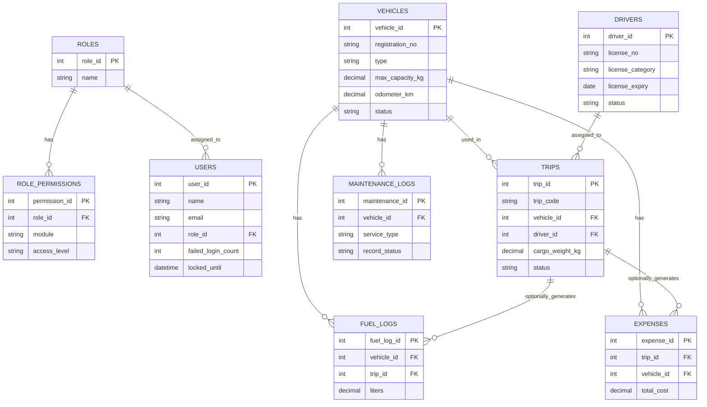

# TransitOps — Database Design (database.md)

Derived strictly from screenshot field data (Modules 0–8) + `specs.md`/`architecture.md`. No SQL — descriptive types only. Fields not visible in any screenshot or PDF are not invented; each such gap is marked **[DECISION – verify]** and listed in §9.

---

## 1. Database Overview

Relational model. Vehicle/Driver `status` fields are mutated **only** by the Rules Engine (architecture.md §3/§10) — every entity below assumes that constraint rather than re-stating it per table. Role permissions are data-driven (own table), not hardcoded, per architecture.md §8.

---

## 2. Entities

### 2.1 Roles
*Purpose:* the 4 fixed access levels. *Source: Screenshot 0, Screenshot 8.*

| Field | Type | Nullable | Unique |
|---|---|---|---|
| role_id | Integer (PK) | No | Yes |
| name | String | No | Yes |

- Fixed seed values: Fleet Manager, Dispatcher, Safety Officer, Financial Analyst (Screenshot 0 login role selector; Screenshot 8 RBAC table rows).
- **Edge case:** treated as a table, not a hardcoded enum, so a 5th role (e.g. Super Admin — flagged missing in specs.md §16.4) can be added without a schema change.

### 2.2 Role Permissions
*Purpose:* configurable module-level access per role. *Source: Screenshot 8 RBAC matrix.*

| Field | Type | Nullable | Unique |
|---|---|---|---|
| permission_id | Integer (PK) | No | Yes |
| role_id | FK → Roles | No | — |
| module | String (enum: Fleet, Drivers, Trips, Fuel/Exp, Analytics, Settings) | No | — |
| access_level | String (enum: None, View, Edit) | No | — |

- Unique constraint on (role_id, module) — one access level per role per module.
- **Edge case / gap:** Screenshot 8's matrix is only partially legible; exact access_level per role/module is not confirmed (specs.md §16.3). Seed values below are placeholders, not confirmed data.
- **[DECISION – verify]** `Settings` module is not one of the RBAC matrix's visible columns (Fleet/Drivers/Trips/Fuel-Exp/Analytics) — access to Settings itself is currently unrestricted in this model pending specs.md §17.2.

### 2.3 Users
*Purpose:* login accounts. *Source: Screenshot 0 (login form, error state), header avatar "Raven K." / "RK" seen across all 9 screenshots.*

| Field | Type | Nullable | Unique |
|---|---|---|---|
| user_id | Integer (PK) | No | Yes |
| name | String | No | No |
| email | String | No | Yes |
| password_hash | String | No | No |
| role_id | FK → Roles | No | — |
| failed_login_count | Integer, default 0 | No | — |
| locked_until | DateTime | Yes | — |
| created_at | DateTime | No | — |

- One role per user ("one login, four roles" — Screenshot 0).
- **Edge case (lockout):** `failed_login_count` increments on failed attempt, resets to 0 on success. At count = 5, `locked_until` is set to now + cooldown (architecture.md §7, duration still open — specs.md §17.1). Login is blocked while `locked_until` is in the future, regardless of credential correctness, and automatically unblocks once it passes — no manual admin unlock is assumed unless later confirmed otherwise.
- **[DECISION – verify]** No password-reset/"Forgot password?" table modeled — link exists in Screenshot 0 but flow is undocumented (specs.md §16.11). Add a `password_reset_tokens` table when confirmed.

### 2.4 Vehicles
*Purpose:* fleet master list. *Source: Screenshot 2 (Vehicle Registry columns + sample rows).*

| Field | Type | Nullable | Unique |
|---|---|---|---|
| vehicle_id | Integer (PK) | No | Yes |
| registration_no | String | No | **Yes** |
| name | String (e.g. "VAN-05") | No | No |
| type | String (enum: Van, Truck, Mini, …) | No | No |
| max_capacity_kg | Decimal | No | No |
| odometer_km | Decimal, default 0 | No | No |
| acquisition_cost | Decimal | No | No |
| status | String (enum: Available, On Trip, In Shop, Retired) | No | No |
| created_at / updated_at | DateTime | No | — |

- Unique index on `registration_no` — Business Rule 1 (specs.md §9.1), also stated on-screen: *"Rule: Registration No. must be unique."*
- **Edge case:** `type` list is not confirmed exhaustive (only Van/Truck/Mini observed) — modeled as an open string enum, not a fixed hard-coded set, so new types don't require a migration (specs.md §16.5 flags this same ambiguity for License Category).
- **Edge case (no hard delete):** Vehicles are never physically deleted — `Retired` is the terminal status instead. This preserves referential integrity for historical Trips/Maintenance/Fuel records tied to a vehicle that's no longer active. **[DECISION – verify]** — not stated explicitly anywhere, but required to avoid orphaned foreign keys once a vehicle is retired.
- **Edge case:** `odometer_km` must never decrease. Enforced at the point a Trip completion writes a new odometer value (architecture.md §5 decision — Dispatcher enters final odometer).
- **Validation:** `status` transitions only via Rules Engine (Dispatch/Complete/Cancel/Maintenance open-close — specs.md §9); direct edits to `status` from the Vehicle Registry screen itself are out of scope of the documented rules and should be restricted (e.g. only Retired↔non-Retired manual toggle, if that's confirmed later — specs.md §16.10 flags the Retired trigger as undocumented).

### 2.5 Drivers
*Purpose:* driver profiles + compliance data. *Source: Screenshot 3 (Drivers & Safety Profiles).*

| Field | Type | Nullable | Unique |
|---|---|---|---|
| driver_id | Integer (PK) | No | Yes |
| name | String | No | No |
| license_no | String | No | **Yes** *[DECISION – verify]* |
| license_category | String (enum: LMV, HMV, …) | No | No |
| license_expiry | Date | No | No |
| contact_number | String | No | No |
| safety_score | Decimal (%) | Yes | No |
| trip_completion_pct | Decimal (%) | Yes | No |
| status | String (enum: Available, On Trip, Off Duty, Suspended) | No | No |
| created_at / updated_at | DateTime | No | — |

- **Edge case:** `license_no` uniqueness is not explicitly stated in any source document (unlike Vehicle registration_no, which is explicit) but is modeled as unique by default, since a duplicate license number for two different drivers is logically invalid — flagged **[DECISION – verify]**.
- **Edge case (expiry vs. status):** license expiry is time-dependent, so trip-assignment eligibility (Business Rule 3) must be checked **dynamically against `license_expiry` at assignment time**, not solely against a stored `status` value — a license can silently become expired without any status update ever being triggered. This is called out explicitly because specs.md §16.10 flags that Suspended/Off Duty triggers aren't documented at all, meaning `status` alone can't be trusted as the sole gatekeeper.
- **Edge case:** `contact_number` is displayed masked in the UI ("98765x****x") but stored in full — masking is a presentation concern, not a storage concern (specs.md §16 masking note).
- `trip_completion_pct` / `safety_score` are treated as derived/rolling metrics, not directly editable fields.

### 2.6 Trips
*Purpose:* dispatch records. *Source: Screenshot 4 (Trip Dispatcher, Live Board, create-trip form).*

| Field | Type | Nullable | Unique |
|---|---|---|---|
| trip_id | Integer (PK) | No | Yes |
| trip_code | String (e.g. "TR001") | No | Yes |
| source | String | No | No |
| destination | String | No | No |
| vehicle_id | FK → Vehicles | No | — |
| driver_id | FK → Drivers | No | — |
| cargo_weight_kg | Decimal | No | No |
| planned_distance_km | Decimal | No | No |
| status | String (enum: Draft, Dispatched, Completed, Cancelled) | No | No |
| final_odometer_km | Decimal | Yes | No |
| fuel_consumed_l | Decimal | Yes | No |
| eta_minutes | Integer | Yes | No |
| created_at / updated_at | DateTime | No | — |

- `trip_code` unique, human-readable (TR001, TR004, TR006 observed).
- **Edge case (capacity):** at creation/dispatch, `cargo_weight_kg` must be ≤ the selected vehicle's `max_capacity_kg` — directly demonstrated on-screen: "Capacity exceeded by 200 kg – dispatch blocked" (Business Rule 5).
- **Edge case (availability):** `vehicle_id`/`driver_id` selectable only among rows with `status = Available` at selection time — enforced at the API layer per the "AVAILABLE ONLY" labels on both dropdowns (Business Rule 2, 3, 4).
- **Edge case (cancel from Draft vs. Dispatched):** Business Rule 8 only restores vehicle/driver to Available when cancelling a **Dispatched** trip — because a Draft trip's vehicle/driver were never flipped to On Trip in the first place (Dispatch is the trigger, per Business Rule 6). Cancelling a Draft trip must **not** attempt to restore status for an entity that was never changed. This distinction is not explicit in the PDF but follows directly from Business Rules 6–8 read together, and is called out here to prevent a state-machine bug.
- `final_odometer_km` / `fuel_consumed_l` are populated only at Completion (architecture.md §5 decision: manual entry by Dispatcher) — nullable until then.
- **[DECISION – verify]** Whether `status = Completed` can later transition to `Cancelled` is unconfirmed (specs.md §17.4) — modeled as **not allowed** by default (Cancelled only reachable from Draft/Dispatched).
- **[DECISION – verify]** `source`/`destination` are free-text strings, not FKs to a Locations table — no Locations/Depots entity is documented anywhere despite Settings having a single "Depot Name" field (Screenshot 8). See §10 Future Tables.

### 2.7 Maintenance Logs
*Purpose:* service records. *Source: Screenshot 5.*

| Field | Type | Nullable | Unique |
|---|---|---|---|
| maintenance_id | Integer (PK) | No | Yes |
| vehicle_id | FK → Vehicles | No | — |
| service_type | String (e.g. Oil Change, Engine Repair, Tyre Replace) | No | No |
| cost | Decimal | No | No |
| service_date | Date | No | No |
| record_status | String (enum: Active/In Shop, Completed) | No | No |
| created_at / updated_at | DateTime | No | — |

- **Edge case (two status fields):** the Maintenance screen has its own `record_status` (Active/Available/In Shop seen as toggle options, In Shop/Completed seen in the Service Log table) **separate** from `Vehicles.status`. Per architecture.md §6 decision, these are kept decoupled: opening a maintenance record (`record_status` = Active/In Shop) drives `Vehicles.status → In Shop`; closing it (`record_status` = Completed) drives `Vehicles.status → Available` (unless the vehicle is Retired). This mapping is a **[DECISION – verify]** since the PDF doesn't spell out the two fields' relationship (specs.md §16.8).
- **Edge case (overlapping records):** the source documents don't say whether a vehicle can have more than one open (Active/In Shop) maintenance record at once. **[DECISION – verify]**: recommend disallowing a second open record for a vehicle that already has one open, to prevent conflicting "close maintenance" events from prematurely marking the vehicle Available while other work is still in progress.

### 2.8 Fuel Logs
*Purpose:* fuel purchase records. *Source: Screenshot 6 (Fuel Logs table, "Log Fuel" action).*

| Field | Type | Nullable | Unique |
|---|---|---|---|
| fuel_log_id | Integer (PK) | No | Yes |
| vehicle_id | FK → Vehicles | No | — |
| trip_id | FK → Trips | **Yes** | — |
| log_date | Date | No | No |
| liters | Decimal | No | No |
| fuel_cost | Decimal | No | No |

- `trip_id` nullable: most fuel logs in the screenshot are standalone (by vehicle + date only), but the "On Complete: odometer → fuel log → expenses" note (Screenshot 4) implies a fuel log can also be generated as a side-effect of trip completion — modeling it as optional covers both cases. **[DECISION – verify]**
- **Edge case:** `liters` and `fuel_cost` must be positive values — not stated explicitly but implied by every sample value being a positive number with no zero/negative cases shown.

### 2.9 Expenses
*Purpose:* toll/misc/maintenance-linked costs. *Source: Screenshot 6 (Other Expenses table, "+ Add Expense").*

| Field | Type | Nullable | Unique |
|---|---|---|---|
| expense_id | Integer (PK) | No | Yes |
| trip_id | FK → Trips | Yes | — |
| vehicle_id | FK → Vehicles | No | — |
| toll_cost | Decimal, default 0 | No | No |
| other_cost | Decimal, default 0 | No | No |
| maintenance_linked | Boolean, default false | No | No |
| total_cost | Decimal | No | No |

- `trip_id` nullable — one sample row (TRK-12, ₹340 toll + ₹150 other + ₹18,000) has no visible trip code, suggesting some expenses are vehicle-level only, not trip-level.
- `total_cost` = toll_cost + other_cost + (linked maintenance cost, if `maintenance_linked` = true). **[DECISION – verify]** whether this is stored (denormalized, recalculated on write) or computed purely on read; stored is recommended here since Reports (§2.10-equivalent, specs.md §8 Reports & Analytics) needs fast aggregation for "Total Operational Cost (Auto) = Fuel + Maintenance."

### 2.10 Settings
*Purpose:* depot/system configuration. *Source: Screenshot 8 (General section).*

| Field | Type | Nullable | Unique |
|---|---|---|---|
| setting_id | Integer (PK) | No | Yes |
| depot_name | String | No | No |
| currency | String (e.g. INR) | No | No |
| distance_unit | String (e.g. Kilometers) | No | No |

- **Edge case / open question:** only a single depot name is shown; whether TransitOps supports multiple depots (multi-tenant) or exactly one global settings row is unconfirmed. Modeled here as a single-row table. See §10 Future Tables for the multi-depot alternative.

---

## 3. Referential Integrity

- Trips.vehicle_id / Trips.driver_id → must reference existing Vehicles/Drivers (no delete of a Vehicle/Driver with Trip history — see §2.4 no-hard-delete rule; same principle applies to Drivers).
- Maintenance Logs, Fuel Logs, Expenses all cascade-restrict on Vehicle deletion (i.e., deletion is blocked, not cascaded, since these are financial/history records) — **[DECISION – verify]**, consistent with the no-hard-delete approach for Vehicles.
- Role Permissions cascade-delete if a Role is deleted (unlikely in practice since Roles are a fixed seed set).

## 4. Migration Order

1. Roles
2. Role Permissions
3. Users
4. Vehicles
5. Drivers
6. Trips
7. Maintenance Logs
8. Fuel Logs
9. Expenses
10. Settings

## 5. Seed Data

- **Roles:** Fleet Manager, Dispatcher, Safety Officer, Financial Analyst (confirmed, Screenshot 0/8).
- **Role Permissions:** placeholder rows only — real values pending specs.md §16.3 confirmation. Do not treat as final.
- **Settings:** one default row (depot_name, currency = INR, distance_unit = Kilometers) — mirrors Screenshot 8 sample, but sample values should not be assumed to be the actual production defaults.
- Demo Vehicle/Driver/Trip/Maintenance/Fuel/Expense rows exist in the screenshots (e.g. VAN-05, TRUCK-11, MINI-03, Alex, John, TR001) purely as illustrative UI mock data — **not** proposed as real seed data.

## 6. ER Diagram (Mermaid)

## 7. Optimization Suggestions

- Unique index: Vehicles.registration_no, Drivers.license_no *(pending §2.5 verify)*, Trips.trip_code, Users.email.
- Composite index: Drivers(status, license_expiry) — supports the dynamic assignment-eligibility check (§2.5 edge case) in one lookup.
- Index: Vehicles.status, Drivers.status — both filtered constantly by the "available only" dispatch dropdowns.
- Foreign key indexes on all *_id columns in Trips, Maintenance Logs, Fuel Logs, Expenses (heavily joined for Reports).
- Consider a rollup/summary table for Reports (§specs.md §8 Reports & Analytics) if per-request aggregation across Fuel Logs + Expenses + Maintenance becomes slow at scale — not needed at current documented data volume.

## 8. Future Tables

- **Locations/Depots** — normalize Trip source/destination and Settings depot_name once multi-depot support is confirmed (§2.6, §2.10).
- **Audit Log** — flagged missing in specs.md §16.11/architecture.md §18; would track who changed what status, when.
- **Notifications** — for the bonus license-expiry email reminder feature (specs.md §4).
- **Documents/Attachments** — only if license scans, vehicle documents, or expense receipts become a confirmed requirement (none documented currently).
- **Password Reset Tokens** — once the "Forgot password?" flow (Screenshot 0) is specified.

---

## 9. Consolidated [DECISION – verify] Log

1. `role_permissions.access_level` seed values are placeholders (§2.2).
2. Settings module's own access scope isn't in the RBAC matrix columns (§2.2).
3. `drivers.license_no` uniqueness assumed, not confirmed (§2.5).
4. `fuel_logs.trip_id` and `expenses.trip_id` nullability/linkage assumed (§2.8, §2.9).
5. `expenses.total_cost` stored vs. computed-on-read (§2.9).
6. Vehicles/Drivers/Maintenance/Fuel/Expenses use no-hard-delete / restrict-on-delete (§2.4, §3).
7. Trip `Completed → Cancelled` disallowed by default (§2.6).
8. Maintenance `record_status` ↔ Vehicle `status` mapping (§2.7).
9. One open maintenance record per vehicle at a time (§2.7).
10. Single-row Settings (no multi-depot) (§2.10).

All ten map directly to open items in `specs.md` §16–17 — resolve there first, then update this file rather than `api.md`, since these are structural, not endpoint-level, decisions.
